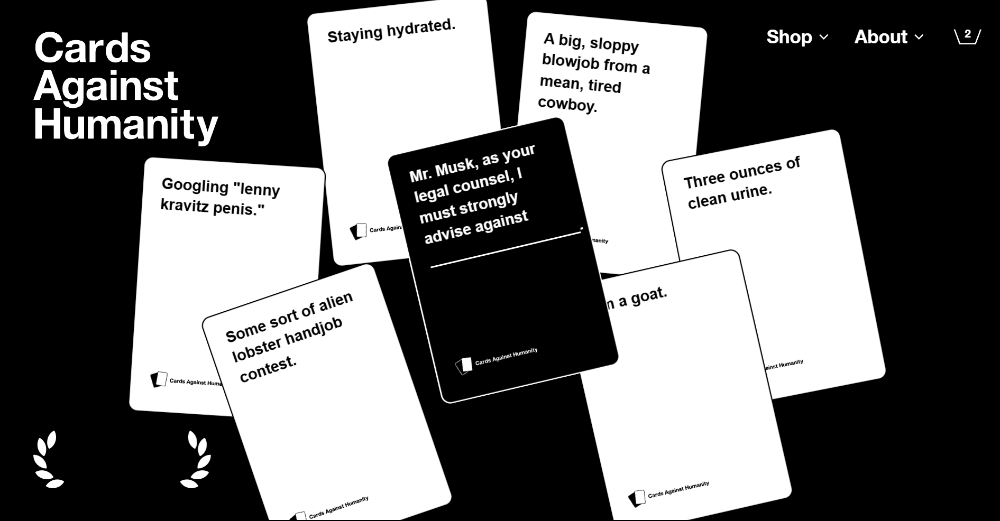
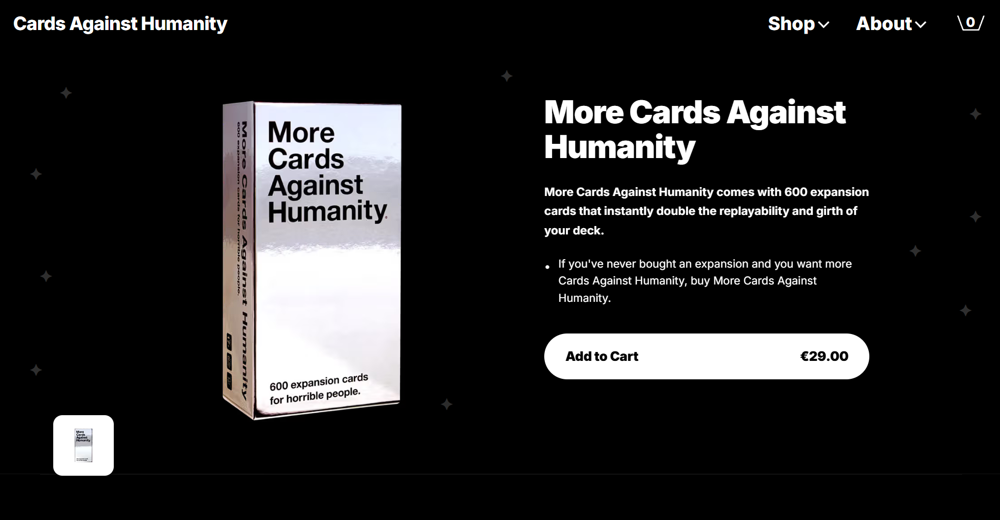
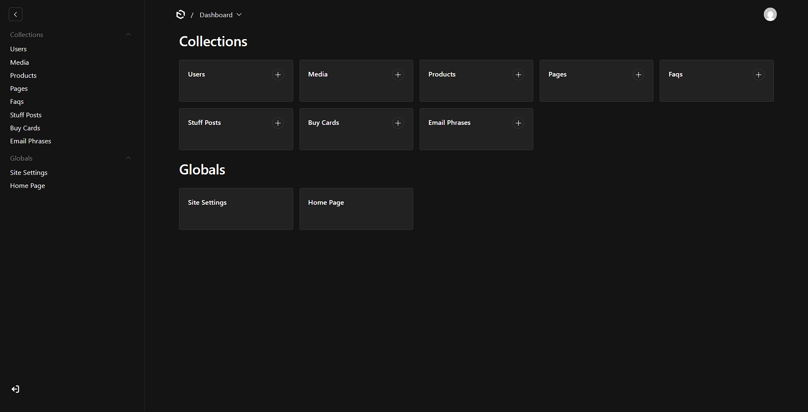

# Cards Against Humanity — Fullstack Headless Commerce Clone

Comprehensive, content-driven recreation of cardsagainsthumanity.com. The stack pairs a Next.js App Router storefront with Payload CMS for content and Medusa v2 for commerce, plus a two-way sync between CMS and Medusa so product data stays aligned.

---

## Screenshots

- Homepage: 
- Product Cards: 
- CMS Dashboard: 

---

## Features

- Fully content-driven homepage powered by Payload CMS
- Product synchronization between Payload CMS and Medusa
- Custom motion/scroll interactions with GSAP and Keen Slider
- Client-side cart and checkout via Medusa Store API
- Webhook-based data synchronization (Medusa → Payload) plus CMS afterChange hook (Payload → Medusa)
- Modular CMS collections for hero, buy cards, stuff posts, FAQs, pages, and media

---

## Why This Architecture

This project demonstrates a headless commerce architecture where:

- Payload CMS manages all marketing and merchandising content
- Medusa handles commerce logic, products, variants, carts, and checkout
- Next.js serves as the storefront, consuming CMS content and Medusa store APIs

This separation lets content editors ship updates without touching commerce code while keeping product data synchronized across systems.

---

## Overview

- **Frontend:** Next.js App Router, Tailwind CSS, custom animations, client-side cart using Medusa Store API.
- **CMS:** Payload CMS (MongoDB) manages all marketing content, product metadata, media, and homepage layouts.
- **Commerce:** Medusa v2 (PostgreSQL, optional Redis) handles products, variants, carts, and checkout state. Publishable key is used on the storefront; admin token is used by the CMS sync hook.
- **Sync:** Payload `afterChange` hook pushes products to Medusa; Medusa webhooks + subscriber push changes back to Payload; frontend webhook keeps Payload up to date from Medusa events.

---

## Architecture Diagram (text)

```
                   +-----------------------+
                   |    Payload CMS        |
                   |  (MongoDB + Blob)     |
                   +-----------------------+
                     ↑   ↑            ↑
   AfterChange hook   |   |            | REST (content)
   (create/update)    |   |            |
   to Medusa Admin    |   |            |
                     |   |            |
 +-------------------+---+------------+-------------------+
 |                   |                |                   |
 |  Medusa Backend   |  Webhook → FE  |   Frontend (Next) |
 |  (PostgreSQL)     |                |   Tailwind/GSAP   |
 +-------------------+----------------+-------------------+
          ↑                  | REST (Medusa Store API)      
          | Subscriber       | reads carts/products         
          | (product.updated)|                             
          +------------------+                             

Legend: CMS → Medusa (afterChange); Medusa → CMS (subscriber + webhook handled in FE route); Frontend reads from CMS for content and Medusa for cart/checkout.
```

---

## Tech Stack

- Next.js (App Router) + Tailwind CSS
- Payload CMS 3 (MongoDB + Vercel Blob storage)
- Medusa v2 (PostgreSQL, optional Redis)
- GSAP, Keen Slider
- Deployed: Vercel (frontend + CMS), Render (Medusa)

---

## Prerequisites

- Node.js 20.x (Medusa requires 20.x; Payload supports 18/20)
- npm 10+ (package-lock present); pnpm 9/10 also supported in CMS
- Datastores: PostgreSQL (Medusa), MongoDB (Payload), optional Redis
- Vercel account (frontend, CMS) and Render account (Medusa) for deployments

---

## Project Structure

/cardsagainsthumanity
 ├── frontend/   → Next.js storefront
 ├── cms/        → Payload CMS
 ├── medusa/     → Medusa backend
 └── README.md

---

## Setup (per service)

### Frontend (Next.js)
```bash
cd frontend
npm install
cp .env.example .env.local  # if you keep an example; otherwise create .env.local
npm run dev                  # http://localhost:3000
```

### CMS (Payload)
```bash
cd cms
npm install
cp .env.example .env
# Fill env values (see Environment Variables)
npm run dev                  # http://localhost:3001
```

### Medusa Backend
```bash
cd medusa
npm install
cp .env.template .env
# Fill env values (see Environment Variables)
npx medusa db:migrate        # apply schema
npm run dev                  # http://localhost:9000
```

---

## Environment Variables

### Frontend
| Variable | Description |
| --- | --- |
| NEXT_PUBLIC_CMS_URL | Public URL of Payload API (e.g., http://localhost:3001). |
| PAYLOAD_API_KEY | Payload user API key used by the Medusa webhook route to patch products. |
| NEXT_PUBLIC_MEDUSA_URL | Medusa store API base (e.g., http://localhost:9000). |
| NEXT_PUBLIC_MEDUSA_PUBLISHABLE_KEY | Publishable key from Medusa Admin → Settings → API Keys. |
| NEXT_PUBLIC_MEDUSA_REGION_ID | Region ID used when creating carts. |

### CMS (Payload)
| Variable | Description |
| --- | --- |
| DATABASE_URL | MongoDB connection string. |
| PAYLOAD_SECRET | Auth/CSRF secret for Payload. |
| BLOB_READ_WRITE_TOKEN | Vercel Blob token for media storage. |
| NEXT_PUBLIC_FRONTEND_URL | Allowed origin for CORS/CSRF. |
| NEXT_PUBLIC_CMS_URL | Public CMS URL (used in CORS + CSRF). |
| CMS_PUBLIC_URL or PAYLOAD_PUBLIC_SERVER_URL | Absolute CMS base used to resolve media URLs. |
| MEDUSA_URL | Medusa admin base (defaults to http://localhost:9000). |
| MEDUSA_ADMIN_TOKEN | Medusa secret key used by the afterChange hook to create/update products. |
| VERCEL_URL | (auto on Vercel) added to allowed origins. |

### Medusa
| Variable | Description |
| --- | --- |
| DATABASE_URL | Postgres connection string. |
| USE_REDIS | `true` to enable Redis; otherwise modules run in memory. |
| REDIS_URL | Redis connection string (required if USE_REDIS=true). |
| STORE_CORS | Allowed origins for store API (e.g., http://localhost:3000). |
| ADMIN_CORS | Allowed origins for admin API (e.g., http://localhost:9000). |
| AUTH_CORS | Allowed origins for auth endpoints. |
| JWT_SECRET | JWT secret for sessions. |
| COOKIE_SECRET | Cookie signing secret. |
| PORT | Port Medusa listens on (default 9000). |
| DISABLE_ADMIN | `true` to disable admin UI. |
| PAYLOAD_URL | Payload base URL for the Medusa subscriber. |
| PAYLOAD_SECRET | Payload user API key for the subscriber sync. |

---

## CMS Structure (Payload collections/globals)

- **Globals**
  - `home-page`: hero quotes, about copy, buy/steal/stuff/email/FAQ headings, footer link sets.
  - `site-settings`: site title, footer text, nav/footer links.
- **Collections**
  - `products`: title, slug, description, price (cents), mainImage, galleryImages, Medusa IDs (`medusaId`, `variantId`); afterChange sync to Medusa.
  - `faqs`: question, rich-text answer, order, published flag.
  - `buy-cards`: homepage buy carousel cards, colors, CTA, floating images (upload + positioning), order/published.
  - `stuff-posts`: “Stuff we’ve done” cards with tag, headline, illustration, CTA, colors, order/published.
  - `email-phrases`: rotating email headline phrases with order/published.
  - `pages`: generic pages with hero, sections, and slugs.
  - `media`: upload collection with `alt` text.
  - `users`: auth-enabled admin users (API key support).

---

## Medusa Integration (storefront)

- Storefront uses the Medusa **Store API** via `NEXT_PUBLIC_MEDUSA_URL` and publishable key.
- Carts are created client-side (`POST /store/carts` with region) and persisted in `localStorage`.
- Line items are added via `POST /store/carts/:id/line-items`; checkout flow uses payment collections, then `POST /store/carts/:id/complete`.
- Product display data comes from Payload (rich content + images) while price/variant IDs are synced from Medusa for accurate checkout.

---

## CMS ↔ Medusa Sync

- **CMS → Medusa:** Payload `products` collection has an `afterChange` hook that:
  - Resolves `mainImage` to an absolute URL using `CMS_PUBLIC_URL`/`PAYLOAD_PUBLIC_SERVER_URL`.
  - On create: calls Medusa Admin API to create a product + default variant (price in cents), sets thumbnail from main image, then writes back `medusaId` and `variantId` to the Payload doc.
  - On update: updates Medusa product fields and variant price when `variantId` is present.

- **Medusa → CMS:**
  - **Medusa subscriber** (`medusa/src/subscribers/sync-to-payload.js`): listens to `product.updated` and patches the matching Payload product (by `medusaId`) using `PAYLOAD_URL` and `PAYLOAD_SECRET`.
  - **Frontend webhook** (`frontend/app/api/medusa-webhook/route.ts`): handles `product.updated`/`product.created` webhooks, creates or updates the Payload product (title, description, price, variantId).

---

## Deployment

- **Frontend (Next.js) — Vercel:** push `frontend/`, set env vars, `vercel --prod` or Git integration.
- **CMS (Payload) — Vercel:** push `cms/`, set env vars (including Blob token), `vercel --prod`.
- **Medusa — Render:** create Web Service from `medusa/`; build `npm install && npx medusa db:migrate`; start `npm start`; attach PostgreSQL and set env vars.


---

## Live URLs

| Service | URL |
| --- | --- |
| Frontend | https://cardsagainsthumanity-frontend.vercel.app |
| Payload CMS | https://cardsagainsthumanity-cms.vercel.app |
| Medusa API | https://cardsagainsthumanity-7vct.onrender.com |

Replace placeholders with deployed URLs.


---

## License

MIT License. You are free to use, modify, and distribute under the terms of the MIT license.

---

Happy building!